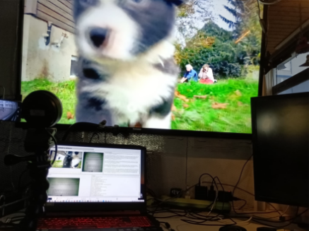

docLocation: file:///D:\ALL\_DEVEL\_VIP\DOC\Anaconda\_PY\_ObjectDetect\_Tensor\_ORANGE\
markdown made with: <https://products.aspose.app/words/conversion/word-to-md#google_vignette>

**HOW2 - PyQt5 Webcam Object Detection and Interpretation**

A multi-threaded PyQt5 application that processes live webcam feeds, detects objects using YOLOv7, interprets scenes with Ollama, and provides a combined textual and auditory description. The application offers a unique combination of precise object detection and abstract interpretation, making it accessible, interactive, and insightful.

-----
**Features**

- **Live Webcam Feed**: Displays the live video stream in a PyQt5 GUI.
- **YOLOv7 Object Detection**: Identifies and counts objects in the scene with bounding boxes and confidence scores.
- **Ollama Scene Interpretation**: Generates natural language descriptions of the entire scene.
- **Combined Output**: Merges YOLO's factual detection with Ollama's abstract interpretation into a unified textual description.
- **Text-to-Speech (TTS)**: Reads out the combined YOLO-Ollama result for auditory feedback.
- **Thread Synchronization**: Efficiently manages webcam, YOLO, Ollama, and TTS processing using a custom status manager (tts\_done, tts\_go, tts\_busy).
- **PyQt5 GUI**: Allows the user to see both the live video feed with YOLO-detected bounding boxes and the textual output.
-----
**Use Cases**

- **Accessibility**: Assists visually impaired users by providing spoken descriptions of their surroundings, combining detailed object detection with scene-level interpretation.
- **Interactive Learning**: Teaches users how AI detects and interprets visual information.
- **Surveillance and Monitoring**: Describes movements and objects detected by the camera, useful for home security or other monitoring scenarios.
- **Artistic Exploration**: Combines AI's literal and abstract perception to offer unique insights into a scene.
-----
**Screenshots**

****

**Setup: webcam + \_ollamaImg2SpeachYolo\_ger\_gui.py**  

-----
**Installation**

**Prerequisites**

- Python 3.8 or higher ( e.g. conda   activate py39y7 )
- A webcam connected to the system
- Virtual environment (recommended)

**Dependencies**

Install the required libraries:

pip install PyQt5 opencv-python pillow torch torchvision matplotlib

pip install yolov7-sdk ollama-sdk

**Clone the Repository**

git clone https://github.com/yourusername/pyqt5-webcam-object-detection.git

cd pyqt5-webcam-object-detection

-----
**Usage**

1. **Start the application**:
1. python \_ollamaImg2SpeachYolo\_ger\_gui.py 
1. **How it works**:
   1. The live webcam feed is displayed in the GUI.
   1. OllamaThread is taking a CamFrame - generates a natural language description of the scene.
   1. YOLO is taking same Frame as Ollama - detects objects in THIS frame and overlays bounding boxes on the feed.
   1. The combined YOLO-Ollama result is displayed as text in the GUI and read aloud via TTS.
1. **What you see and hear**:
   1. Textual description: "YOLO detects the following objects: 2 people and 1 dog. Ollama interprets the scene as: A park with people walking and a dog resting nearby."
   1. The same text is spoken via TTS.
-----
**Project Structure**

pyqt5-webcam-object-detection/

├── \_ollamaImg2SpeachYolo\_ger\_gui.py  # Main entry point for the application

├── class StatusManager      	# Manages thread synchronization with flags

├── threads/

│   ├── class webcam\_thread   	# Captures frames from the webcam

│   ├── class yolo\_thread     	# Processes YOLO object detection

│   ├── class ollama\_thread.py   	# Generates scene interpretation with Ollama

│   ├── class text2SpeachThread      	# Converts text to speech

├── gui/

│   ├── main\_window.ui     # PyQt5 GUI layout

│   ├── app.py             # GUI logic and integration

├── utils/

│   ├── combine\_texts.py   # Combines YOLO and Ollama results

│   ├── visualization.py   # Draws YOLO bounding boxes on frames

├── README.md              # Project documentation

└── requirements.txt       # Python dependencies ( do it with pipreqs --force   / compact req.-file!!

-----
**How It Works**

1. **Webcam Thread**:
   1. Captures frames from the webcam and sends them to the YOLO thread.
1. **YOLO Thread**:
   1. Processes the frame using YOLOv7, detects objects, and generates a factual description.
1. **Ollama Thread**:
   1. Interprets the scene based on the frame and generates an abstract description.
1. **TTS Thread**:
   1. Combines the YOLO and Ollama results and reads them aloud.
1. **Thread Synchronization**:
   1. Ensures tasks are executed in the right sequence using a status manager.
-----
**Customization**

- **Change YOLO Confidence Threshold**:
  - Adjust the minimum confidence score for object detection in yolo\_thread.py: 
  - score\_threshold = 0.6
- **Modify Ollama Prompt**:
  - Customize the text sent to Ollama in ollama\_thread.py: 
  - content = "Describe this image in a single sentence."
- **Use a Different TTS Engine**:
  - Replace the TTS library in tts\_thread.py with your preferred engine.
- **Add New Features**:
  - Extend the application by adding more AI models or integrating additional sensors.
-----
**Contributing**

Contributions are welcome! Feel free to fork the repository and submit pull requests with improvements or new features.

-----
**License**

This project is licensed under the MIT License. See the LICENSE file for details.

-----
**Acknowledgments**

- **YOLOv7**: For fast and accurate object detection.
- **Ollama SDK**: For natural language scene interpretation.
- **PyQt5**: For building the GUI.
- **OpenCV**: For frame processing and visualization.
- **TTS Libraries**: For converting text to speech.
-----

**Thanks** 

- YT Video the webcam was analysing: https://www.youtube.com/watch?v=XqTCAL0NvDQ
-----

